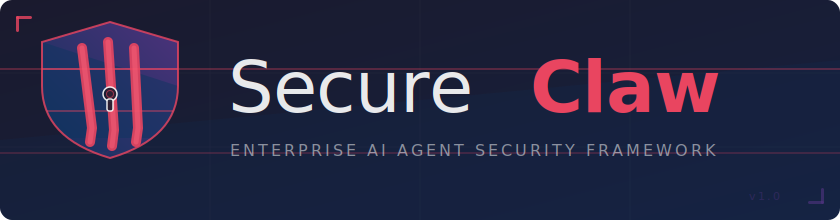

<p align="center">
  
</p>

<p align="center">
  企业级 AI Agent 安全框架 — 在隔离容器中运行 Claude Code 智能体。<br/>
  六层安全管线。多通道消息接入。默认零信任。
</p>

<p align="center">
  <a href="README.md">English</a> ·
  
  
  
  
</p>

---

```
 WhatsApp · Telegram · Slack · Discord
              │
  ┌───────────▼────────────┐
  │  接入层    消息规范化    │  触发词过滤、消息标准化
  │  信任层    信任评估      │  注入检测、速率限制、信任评分
  │  路由层    任务入队      │  任务构建、按群 FIFO 队列
  │  执行层    容器运行      │  容器沙箱、凭证代理、网络策略
  │  记忆层    持久化        │  群组 CLAUDE.md、会话目录生命周期
  │  审计层    日志记录      │  HMAC 哈希链、仅追加日志
  └────────────────────────┘
```

## 目录

- [SecureClaw 简介](#secureclaw-简介)
- [为什么选择 SecureClaw](#为什么选择-secureclaw)
- [与其他项目对比](#与其他项目对比)
- [前置条件](#前置条件)
- [快速开始](#快速开始)
- [详细安装指南](#详细安装指南)
- [配置说明](#配置说明)
- [日常使用](#日常使用)
- [通道配置](#通道配置)
- [管理员命令](#管理员命令)
- [常见问题](#常见问题)
- [安全模型](#安全模型)
- [监控运维](#监控运维)
- [开发指南](#开发指南)
- [项目结构](#项目结构)
- [许可证](#许可证)

## SecureClaw 简介

SecureClaw 是**企业级 AI Agent 安全框架**。它将来自 WhatsApp、Telegram、Slack、Discord 的消息经六层安全管线处理后，在**隔离容器**中运行 Claude Code 智能体，并将回复发回对应群组。适合需要安全可控、可审计、多群组/多通道的团队或企业。

## 为什么选择 SecureClaw

| 优势 | 说明 |
|------|------|
| **安全即架构** | 每条消息都经过六层管线；每个 Agent 任务**默认**在独立容器中执行，无需“记得开沙箱”。 |
| **API Key 不进容器** | 密钥只存在于宿主机，通过凭证代理用会话 token 按需发放；容器内无法拿到原始 Key，从设计上杜绝泄露。 |
| **零信任默认** | 新用户默认不信任，需管理员提升信任级别；能力与网络策略随级别变化。 |
| **企业可审计** | 内置审计日志与 HMAC 哈希链；网络策略（无网 / 仅 Claude API / 开放）内置。 |
| **边界清晰** | 固定 4 通道 + Claude，技术栈简单，便于安全审计与合规说明。 |

## 与其他项目对比

"Claw" 生态发展迅速，以下是 SecureClaw 与主要框架的对比：

| | **SecureClaw** | **OpenClaw** | **NanoClaw** | **ZeroClaw** |
|---|---|---|---|---|
| **定位** | 企业级安全框架 | 个人 AI 助手网关 | 轻量容器优先智能体 | 极简 Rust 运行时 |
| **语言** | TypeScript | TypeScript | TypeScript | Rust |
| **安全模型** | 六层管线（接入 → 信任 → 路由 → 执行 → 记忆 → 审计） | DM 策略门控 + 按会话沙箱 | 仅容器级隔离 | 基于 Trait 的沙箱控制 |
| **信任模型** | 多租户、逐用户信任分级（BLOCKED → UNTRUSTED → TRUSTED → ADMIN） | 单操作者（一个可信用户 + 多个 Agent） | 无内置信任评分 | 白名单 |
| **凭证隔离** | API Key **永不进入容器**；Unix Socket 代理 + 256-bit 会话令牌，每会话限 3 次 | Key 通过环境变量传入 | Key 挂载或传入 | 加密密钥存储 |
| **注入防御** | 13 条启发式规则、0.0–1.0 评分、可配置阈值 | 无内置注入检测 | 无内置注入检测 | 无内置注入检测 |
| **审计链** | 仅追加 SQLite + HMAC 哈希链（防篡改） | 基础日志 | 无审计链 | 可观测性钩子 |
| **网络策略** | 4 种预设：`isolated` / `claude_only` / `trusted` / `open` | 按会话沙箱策略 | 容器默认网络 | 沙箱控制 |
| **通道** | WhatsApp、Telegram、Slack、Discord | 25+ 通道 | WhatsApp、Telegram、Slack、Discord、Gmail | 15+ 通道 |
| **容器运行时** | Docker + Apple Container | Docker | Docker + Apple Container | 内置沙箱 |
| **速率限制** | 逐发送者、可配置 | 无内置速率限制 | 无内置速率限制 | 无内置速率限制 |
| **代码规模** | ~12K 行，558 个测试 | 大型（完整网关） | ~3,900 行 | 单二进制 (8.8 MB) |
| **最适合** | 需要安全、合规和可审计的团队 | 需要最多通道的个人用户 | 追求极简、可改造的开发者 | 追求极致性能的部署 |

### SecureClaw 的核心优势

1. **安全是架构本身，不是附加配置。** 每条消息必须通过六层管线才能到达 Agent。其他框架将安全视为可选项 —— SecureClaw 将其设为默认。

2. **API Key 永远不进容器。** 凭证代理通过 Unix Socket 分发短期会话令牌。即使容器被攻破，攻击者也无法提取原始 Key。其他 Claw 框架均未实现此级别的凭证隔离。

3. **防篡改审计链。** HMAC 哈希链意味着任何删除或修改日志条目的行为都会断链。这对受监管行业和合规需求至关重要。

4. **多租户信任引擎。** OpenClaw 假设只有一个可信操作者。SecureClaw 支持同一群组中多个用户处于不同信任级别，能力和网络策略与级别绑定。

5. **内置 Prompt 注入防御。** 13 条启发式规则在消息到达 Agent 之前对其评分。可配置阈值允许针对不同场景调整灵敏度。

6. **开箱即生产就绪。** 健康检查端点、结构化日志（pino）、指标计数器、系统服务安装器（launchd / systemd）以及 558 个测试全部内置。

## 前置条件

| 依赖 | 版本要求 |
|------|---------|
| Node.js | ≥ 20 |
| 容器运行时 | Docker **或** Apple Container (macOS) |
| Anthropic API Key | 从 [console.anthropic.com](https://console.anthropic.com) 获取 `sk-ant-*` |

## 快速开始

### 1. 克隆并安装

```bash
git clone https://github.com/Alex647648/secureclaw.git && cd secureclaw
bash setup.sh
```

`setup.sh` 会检查 Node.js 版本、运行 `npm install`、验证 native 模块（better-sqlite3）。

### 2. 配置

```bash
cp secureclaw.env.example secureclaw.env
cp secureclaw.example.yaml secureclaw.yaml
```

编辑 `secureclaw.env`，至少设置 API Key：

```env
ANTHROPIC_API_KEY=sk-ant-your-key-here
```

编辑 `secureclaw.yaml`，设置管理群组和通道：

```yaml
app:
  trigger_word: "@SecureClaw"     # 触发词，空字符串表示响应所有消息
  timezone: "Asia/Shanghai"

bootstrap:
  admin_group_id: "main"         # 管理群组内部 ID
  admin_channel_id: "120363xxx@g.us"   # WhatsApp 群 JID / Telegram chat ID 等
  admin_sender_ids:
    - "8613800001111"            # 这些用户获得 ADMIN 信任级别

container:
  runtime: "apple"               # "apple" 或 "docker"
  image: "secureclaw-agent:latest"
  timeout_ms: 1800000            # 每任务最长 30 分钟
  max_concurrent: 5              # 最大并发容器数

channels:
  whatsapp:
    enabled: true
  telegram:
    enabled: false
  slack:
    enabled: false
  discord:
    enabled: false
```

完整配置项见 [`secureclaw.example.yaml`](secureclaw.example.yaml)。

### 3. 构建 Agent 容器镜像

```bash
./container/build.sh
```

### 4. 启动

```bash
npm start
```

启用 WhatsApp 时，首次启动会在终端显示二维码 — 使用手机扫码完成认证。

## 详细安装指南

若需分步执行或生产部署，可按下列步骤操作（需先完成「快速开始」中的配置复制与编辑）：

| 步骤 | 命令 | 说明 |
|------|------|------|
| 1 | `npx tsx setup/index.ts --step environment` | 检查 Node、容器运行时等环境 |
| 2 | `npx tsx setup/index.ts --step container` | 构建 Agent 容器镜像 |
| 3 | `npx tsx setup/index.ts --step credentials -- --key sk-ant-您的Key` | 将 API Key 写入 secureclaw.env |
| 4 | `npx tsx setup/index.ts --step channel-auth` | 按提示完成各通道认证（如 WhatsApp 扫码） |
| 5 | `npx tsx setup/index.ts --step register -- --group-id main --channel-id "群组ID" --channel-type whatsapp` | 注册管理群组（见下） |
| 6 | `npx tsx setup/index.ts --step service` | 安装系统服务（launchd / systemd） |
| 7 | `npx tsx setup/index.ts --step verify` | 验证安装 |

**注册群组时 channel-id 示例**：WhatsApp 群 `"120363xxx@g.us"`；Telegram 群 `"-1001234567890"`；Slack 频道 `"C01234ABCD"`；Discord 频道 `"123456789012345678"`。

## 配置说明

### 环境变量（`secureclaw.env`）

| 变量 | 是否必填 | 说明 |
|------|---------|------|
| `ANTHROPIC_API_KEY` | **必填** | Claude API Key |
| `TELEGRAM_BOT_TOKEN` | 启用 Telegram 时必填 | 从 [@BotFather](https://t.me/BotFather) 获取 |
| `SLACK_BOT_TOKEN` | 启用 Slack 时必填 | `xoxb-*` Bot Token |
| `SLACK_APP_TOKEN` | 启用 Slack 时必填 | `xapp-*` App-Level Token (Socket Mode) |
| `DISCORD_BOT_TOKEN` | 启用 Discord 时必填 | Discord Developer Portal 中的 Bot Token |
| `SC_HEALTH_PORT` | 可选 | 健康检查端口（默认：`9090`） |

### YAML 配置（`secureclaw.yaml`）

| 区块 | 键 | 默认值 | 说明 |
|------|-----|-------|------|
| `app` | `trigger_word` | `@SecureClaw` | 消息触发前缀。空字符串 = 响应所有消息 |
| `app` | `timezone` | `Asia/Shanghai` | 定时任务时区 |
| `container` | `runtime` | `apple` | `apple`（Apple Container）或 `docker` |
| `container` | `timeout_ms` | `1800000` | 任务最长执行时间（30 分钟） |
| `container` | `max_concurrent` | `5` | 最大并发容器数 |
| `security` | `max_injection_score` | `0.75` | 注入检测阈值（0.0–1.0） |
| `security.credential_proxy` | `max_requests_per_session` | `3` | 每会话 API Key 请求次数上限 |
| `logging` | `level` | `info` | `debug` / `info` / `warn` / `error` |

## 部署指南

### 分步安装（适合生产或自定义部署）

同上「详细安装指南」表格；注册示例见该节。

### 系统服务

<details>
<summary><strong>macOS (launchd)</strong></summary>

```bash
launchctl load   ~/Library/LaunchAgents/com.secureclaw.plist   # 开机自启
launchctl unload ~/Library/LaunchAgents/com.secureclaw.plist   # 停止
launchctl kickstart -k gui/$(id -u)/com.secureclaw             # 重启
```
</details>

<details>
<summary><strong>Linux (systemd)</strong></summary>

```bash
systemctl --user enable  secureclaw   # 开机自启
systemctl --user start   secureclaw
systemctl --user stop    secureclaw
systemctl --user restart secureclaw
journalctl --user -u secureclaw -f    # 查看日志
```
</details>

<details>
<summary><strong>WSL</strong></summary>

```bash
bash ~/secureclaw/start-secureclaw.sh
```
</details>

### 生产部署清单

- [ ] `ANTHROPIC_API_KEY` 通过密钥管理器注入（不要明文写在 `.env`）
- [ ] `secureclaw.yaml` 和 `secureclaw.env` 未提交到 git
- [ ] 容器镜像已构建
- [ ] 至少一个通道已启用并完成认证
- [ ] 管理群组已注册，`channel_id` 正确
- [ ] 管理员 sender ID 已配置
- [ ] 系统服务已安装并运行
- [ ] 健康检查端点正常响应：`curl http://127.0.0.1:9090/health`
- [ ] 日志可通过 `journalctl`（Linux）或 Console.app（macOS）查看

## 日常使用

- **群聊触发**：在消息中带上触发词（默认 `@SecureClaw`），例如「@SecureClaw 总结一下刚才的讨论」。该群组需已通过 `!admin group add` 注册。
- **信任级别**：新用户默认为 UNTRUSTED；管理员可用 `!admin trust set <群组> <发送者> <级别>` 提升。级别：BLOCKED → UNTRUSTED → TRUSTED → ADMIN。
- **健康检查**：`curl http://127.0.0.1:9090/health`，返回 200 且 status 为 ok 即正常。
- **查看日志**：直接运行时在终端；系统服务时在 `logs/secureclaw.log`，或 Linux 下 `journalctl --user -u secureclaw -f`。

## 通道配置

<details>
<summary><strong>WhatsApp</strong></summary>

1. 在 `secureclaw.yaml` 中设置 `channels.whatsapp.enabled: true`
2. 启动服务 — 终端显示二维码
3. 打开手机 WhatsApp → 设置 → 关联设备 → 关联新设备 → 扫描二维码
4. 会话数据保存在 `scdata/whatsapp-auth/`
</details>

<details>
<summary><strong>Telegram</strong></summary>

1. 通过 [@BotFather](https://t.me/BotFather) 创建机器人，获取 Token
2. 在 `secureclaw.env` 中设置 `TELEGRAM_BOT_TOKEN`
3. 在 `secureclaw.yaml` 中设置 `channels.telegram.enabled: true`
4. 将机器人添加到群组并设为管理员
</details>

<details>
<summary><strong>Slack</strong></summary>

1. 在 [api.slack.com/apps](https://api.slack.com/apps) 创建 Slack App
2. 启用 Socket Mode，获取 App-Level Token（`xapp-*`）
3. 添加 Bot Token Scopes：`chat:write`、`channels:history`、`groups:history`
4. 安装到工作区，获取 Bot Token（`xoxb-*`）
5. 在 `secureclaw.env` 中设置两个 Token
6. 设置 `channels.slack.enabled: true`
7. 邀请机器人到频道
</details>

<details>
<summary><strong>Discord</strong></summary>

1. 在 [discord.com/developers](https://discord.com/developers/applications) 创建应用
2. 创建 Bot，开启 Message Content Intent
3. 获取 Bot Token，在 `secureclaw.env` 中设置 `DISCORD_BOT_TOKEN`
4. 设置 `channels.discord.enabled: true`
5. 邀请机器人到服务器，需要 `Send Messages` + `Read Message History` 权限
</details>

## 管理员命令

在任何已注册群组中发送（仅 `ADMIN` 信任级别可用）：

| 命令 | 说明 |
|------|------|
| `!admin help` | 显示所有命令 |
| `!admin status` | 系统状态 |
| `!admin group list` | 列出已注册群组 |
| `!admin group add <id> <channel_id> <type>` | 注册新群组 |
| `!admin group remove <id>` | 取消注册群组 |
| `!admin trust set <群组> <发送者> <级别>` | 设置信任级别 |
| `!admin trust get <群组> <发送者>` | 查看信任级别 |
| `!admin task list` | 列出定时任务 |
| `!admin task add <群组> <cron> <提示词>` | 添加定时任务 |
| `!admin task enable/disable <task_id>` | 启用/禁用任务 |

信任级别：`BLOCKED`（0）→ `UNTRUSTED`（1）→ `TRUSTED`（2）→ `ADMIN`（3）

## 常见问题

- **首次启动 WhatsApp 没有二维码？** 确认 `channels.whatsapp.enabled: true`，查看终端或日志报错；可删除 `scdata/whatsapp-auth/` 后重启重新扫码。
- **发了消息但 Agent 没反应？** 检查是否带了触发词、该群组是否已注册（`!admin group list`）、发送者是否被 BLOCKED、是否被速率限制或注入检测拦截（看日志或 /health 的 metrics）。
- **如何更换 API Key？** 修改 `secureclaw.env` 中的 `ANTHROPIC_API_KEY` 并重启；建议 `chmod 600 secureclaw.env`。
- **Docker 和 Apple Container 选哪个？** macOS 两者皆可；Linux 仅支持 docker。
- **secureclaw.env / secureclaw.yaml 会被提交到 Git 吗？** 不会，二者已在 .gitignore 中。

## 安全模型

| 层 | 机制 | 防护目标 |
|----|------|---------|
| **凭证隔离** | API Key 存于进程闭包，通过 Unix Socket 分发 256-bit 会话令牌，每会话限 3 次请求 | Key 泄露 |
| **容器沙箱** | 每任务独立容器、非 root 用户、内存/CPU 限制、挂载白名单 | 容器逃逸、主机入侵 |
| **网络策略** | `isolated`（无网络）/ `claude_only`（代理）/ `trusted` / `open` | 数据外泄 |
| **注入检测** | 13 条启发式规则、0.0–1.0 评分、可配置阈值 | Prompt 注入 |
| **信任引擎** | 逐发送者信任级别、基于能力的工具白名单 | 越权操作 |
| **审计链** | 仅追加 SQLite、HMAC 哈希链 | 责任追溯、日志篡改 |

详见 [SECURITY.md](SECURITY.md)。

## 监控运维

### 健康检查端点

```bash
curl http://127.0.0.1:9090/health
```

```json
{
  "status": "ok",
  "uptime": 3600000,
  "timestamp": 1709827200000,
  "channels": 2,
  "metrics": {
    "tasks":       { "total": 42, "success": 40, "failed": 2 },
    "queue":       { "enqueued": 45, "rejected": 0 },
    "credentials": { "issued": 120 },
    "messages":    { "received": 200, "sent": 42, "rateLimited": 3, "injectionBlocked": 1 }
  }
}
```

`200` = 正常 &nbsp;|&nbsp; `503` = 关闭中 &nbsp;|&nbsp; 端口通过 `SC_HEALTH_PORT` 配置

### 日志

生产环境输出结构化 NDJSON（pino），开发环境输出彩色可读格式。

```bash
npm start | jq .                                    # 格式化输出
npm start | jq 'select(.module == "trust-engine")'  # 按模块过滤
npm start | jq 'select(.level >= 50)'               # 仅错误
```

日志级别通过 `secureclaw.yaml` 中的 `logging.level` 控制。

## 开发指南

```bash
npm run dev          # tsx 热重载
npm run build        # TypeScript 编译
npm test             # 运行全部 558 个测试
npm run test:watch   # 监听模式
npm run typecheck    # 仅类型检查
```

### 测试覆盖

```
core/         配置、类型、工具、健康检查、日志、指标     74 个测试
trust/        信任引擎、注入检测、速率限制             66 个测试
security/     凭证代理、挂载控制、沙箱验证             57 个测试
admin/        管理员命令                             52 个测试
channels/     通道适配器、通道管理器                   45 个测试
db/           数据库操作                             41 个测试
routing/      任务构建、群组队列                      38 个测试
integration/  管线、会话运行器、调度器                 38 个测试
ingress/      消息规范化                             37 个测试
memory/       记忆控制器、会话目录                    29 个测试
execution/    容器后端、网络策略                      29 个测试
cli/          安装向导                               26 个测试
setup/        环境检测、平台、服务、验证               26 个测试
```

## 项目结构

```
secureclaw/
├── src/
│   ├── admin/           管理员命令处理器（!admin）
│   ├── audit/backend/   审计接口 + 本地 SQLite 后端
│   ├── channels/        通道适配器（WhatsApp / Telegram / Slack / Discord）+ 管理器
│   ├── cli/             安装向导
│   ├── core/            配置、类型、工具、入口、健康检查、日志、指标
│   ├── db/              SQLite 数据库（WAL 模式）
│   ├── execution/       容器后端 + 网络策略
│   ├── ingress/         消息规范化
│   ├── integration/     消息管线、会话运行器、调度器
│   ├── memory/          群组记忆（CLAUDE.md）+ 会话目录生命周期
│   ├── routing/         任务构建器 + 群组队列
│   ├── security/        凭证代理、挂载控制器、沙箱验证器
│   └── trust/           信任引擎、注入检测、速率限制
├── setup/               安装 CLI 分步模块
├── container/           Dockerfile + Agent Runner（ESM）
├── assets/              Logo 和 Banner SVG
├── .github/workflows/   CI：类型检查 + vitest
└── .claude/skills/      Claude Code Skills
```

## 许可证

MIT
